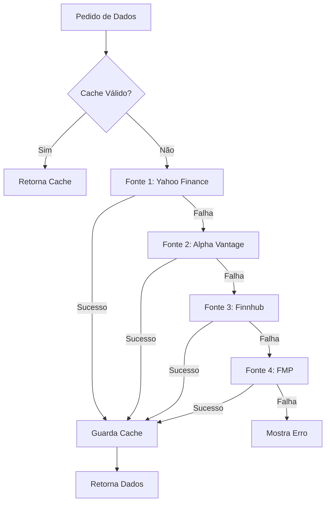

# 🔍 Plano: Correção da Análise Fundamentalista

## 📋 Problema Identificado

A secção **Análise Fundamentalista** do dashboard não está a carregar dados devido a:

1. **Problemas de CORS** com Yahoo Finance API
2. **Falta de fontes alternativas** quando a API principal falha
3. **Ausência de sistema de fallback** robusto
4. **Sem cache eficiente** para reduzir chamadas API

### Estado Atual (Linha 1426-1484)
```javascript
async function fetchFundamentals(ticker) {
  // Tenta Yahoo Finance direto → falha CORS
  // Tenta com proxy CORS → instável/lento
  // Sem alternativas → mostra "N/A"
}
```

---

## 🎯 Objetivos

1. ✅ Resolver problemas de CORS permanentemente
2. ✅ Implementar múltiplas fontes de dados com fallback automático
3. ✅ Criar sistema de cache inteligente
4. ✅ Melhorar experiência do utilizador com feedback claro
5. ✅ Suportar tickers internacionais (US, PT, EU)

---

## 🏗️ Arquitetura Proposta

### 1. Sistema Multi-Fonte com Fallback



### 2. Estrutura de Dados Unificada

```javascript
{
  ticker: "AAPL",
  data: {
    pe: 28.5,
    evEbitda: 18.2,
    roe: 147.5,
    divYield: 0.52,
    netMargin: 25.3,
    debtEbitda: 1.2,
    marketCap: 2800000000000,
    beta: 1.24,
    description: "...",
    sector: "Technology",
    industry: "Consumer Electronics"
  },
  metadata: {
    source: "alphavantage",
    fetchedAt: 1710950000000,
    expiresAt: 1710986400000,
    quality: "high"
  }
}
```

---

## 📊 APIs Selecionadas

### 🥇 Fonte 1: Yahoo Finance (query2)
- **Prioridade**: Alta
- **Custo**: Gratuito
- **Limite**: Sem limite oficial
- **Cobertura**: Global (US, EU, PT)
- **Dados**: Fundamentais completos
- **CORS**: Funciona direto do browser
- **Endpoint**: `https://query2.finance.yahoo.com/v10/finance/quoteSummary/{ticker}`

### 🥈 Fonte 2: Alpha Vantage
- **Prioridade**: Média-Alta
- **Custo**: Gratuito (500 req/dia)
- **Limite**: 5 req/min
- **Cobertura**: Principalmente US
- **Dados**: Fundamentais + técnicos
- **CORS**: Sim (com API key)
- **Endpoint**: `https://www.alphavantage.co/query?function=OVERVIEW&symbol={ticker}&apikey={key}`
- **API Key**: Gratuita em https://www.alphavantage.co/support/#api-key

### 🥉 Fonte 3: Finnhub
- **Prioridade**: Média
- **Custo**: Gratuito (60 req/min)
- **Limite**: 60 req/min
- **Cobertura**: Global
- **Dados**: Fundamentais + notícias
- **CORS**: Sim (com API key)
- **Endpoint**: `https://finnhub.io/api/v1/stock/metric?symbol={ticker}&metric=all&token={key}`
- **API Key**: Gratuita em https://finnhub.io/register

### 🏅 Fonte 4: Financial Modeling Prep (FMP)
- **Prioridade**: Baixa (backup)
- **Custo**: Gratuito (250 req/dia)
- **Limite**: 250 req/dia
- **Cobertura**: US principalmente
- **Dados**: Fundamentais detalhados
- **CORS**: Sim (com API key)
- **Endpoint**: `https://financialmodeprep.com/api/v3/profile/{ticker}?apikey={key}`
- **API Key**: Gratuita em https://site.financialmodeprep.com/developer/docs

---

## 🔧 Implementação Técnica

### Fase 1: Configuração de API Keys

```javascript
// Adicionar no início do <script>
const API_KEYS = {
  alphavantage: localStorage.getItem('api_alphavantage') || '',
  finnhub: localStorage.getItem('api_finnhub') || '',
  fmp: localStorage.getItem('api_fmp') || ''
};

// UI para configurar keys (opcional, mas recomendado)
function openAPISettings() {
  // Modal para inserir API keys
}
```

### Fase 2: Adaptadores por Fonte

```javascript
// Cada API tem formato diferente → normalizar
const DataAdapters = {
  yahoo: (raw) => ({ /* normaliza Yahoo */ }),
  alphavantage: (raw) => ({ /* normaliza AV */ }),
  finnhub: (raw) => ({ /* normaliza Finnhub */ }),
  fmp: (raw) => ({ /* normaliza FMP */ })
};
```

### Fase 3: Sistema de Cache

```javascript
const FundamentalsCache = {
  get(ticker) {
    const cached = localStorage.getItem(`fund_${ticker}`);
    if (!cached) return null;
    const data = JSON.parse(cached);
    // Cache válido por 24h
    if (Date.now() - data.metadata.fetchedAt > 86400000) return null;
    return data;
  },
  set(ticker, data) {
    localStorage.setItem(`fund_${ticker}`, JSON.stringify(data));
  }
};
```

### Fase 4: Orquestrador de Fontes

```javascript
async function fetchFundamentalsMultiSource(ticker) {
  // 1. Verifica cache
  const cached = FundamentalsCache.get(ticker);
  if (cached) return cached;

  // 2. Tenta fontes em ordem de prioridade
  const sources = [
    () => fetchFromYahoo(ticker),
    () => fetchFromAlphaVantage(ticker),
    () => fetchFromFinnhub(ticker),
    () => fetchFromFMP(ticker)
  ];

  for (const fetchFn of sources) {
    try {
      const data = await fetchFn();
      if (data && data.pe !== null) {
        FundamentalsCache.set(ticker, data);
        return data;
      }
    } catch (e) {
      console.warn(`Source failed:`, e);
      continue;
    }
  }

  throw new Error('All sources failed');
}
```

---

## 🎨 Melhorias na UI

### 1. Indicador de Fonte de Dados
```html
<div style="font-size:0.72rem;color:var(--muted)">
  📡 Fonte: <span id="dataSource">Yahoo Finance</span>
  | Actualizado: <span id="dataAge">há 2 horas</span>
</div>
```

### 2. Configuração de API Keys
```html
<button class="btn sm secondary" onclick="openAPISettings()">
  🔑 Configurar APIs
</button>
```

### 3. Estados de Carregamento Melhorados
```javascript
// Loading skeleton mais informativo
"A carregar de Yahoo Finance..."
"Yahoo falhou, tentando Alpha Vantage..."
"Dados carregados com sucesso ✓"
```

---

## 📝 Mapeamento de Dados por API

### Yahoo Finance → Dados Normalizados
| Yahoo Field | Nossa Métrica | Transformação |
|-------------|---------------|---------------|
| `trailingPE` | `pe` | direto |
| `returnOnEquity.raw` | `roe` | × 100 |
| `dividendYield.raw` | `divYield` | × 100 |
| `profitMargins.raw` | `netMargin` | × 100 |

### Alpha Vantage → Dados Normalizados
| AV Field | Nossa Métrica | Transformação |
|----------|---------------|---------------|
| `PERatio` | `pe` | parseFloat |
| `ReturnOnEquityTTM` | `roe` | parseFloat |
| `DividendYield` | `divYield` | parseFloat |
| `ProfitMargin` | `netMargin` | × 100 |

### Finnhub → Dados Normalizados
| Finnhub Field | Nossa Métrica | Transformação |
|---------------|---------------|---------------|
| `metric.peNormalizedAnnual` | `pe` | direto |
| `metric.roeRfy` | `roe` | direto |
| `metric.dividendYieldIndicatedAnnual` | `divYield` | direto |

---

## 🧪 Testes Necessários

### Tickers de Teste
- ✅ **US**: AAPL, MSFT, GOOGL, TSLA
- ✅ **Portugal**: EDP.LS, GALP.LS, NOS.LS
- ✅ **Europa**: SAP.DE, AIR.PA, VOD.L
- ✅ **ETFs**: SPY, QQQ, IWDA.AS

### Cenários
1. Cache vazio → deve buscar de API
2. Cache válido → deve usar cache
3. Cache expirado → deve refrescar
4. API 1 falha → deve tentar API 2
5. Todas APIs falham → deve mostrar erro claro
6. Ticker inválido → deve mostrar mensagem apropriada

---

## 📦 Estrutura de Ficheiros

```
Finance/
├── dashboard.html (atual)
├── plans/
│   └── analise-fundamentalista-fix.md (este ficheiro)
└── (futuro) dashboard-v2.html (com correções)
```

---

## ⚡ Ordem de Implementação

### Sprint 1: Fundação (Crítico)
1. ✅ Criar adaptadores para normalizar dados
2. ✅ Implementar sistema de cache
3. ✅ Corrigir fetchFundamentals com fallback Yahoo → Proxy

### Sprint 2: APIs Alternativas (Alta Prioridade)
4. ✅ Integrar Alpha Vantage
5. ✅ Integrar Finnhub
6. ✅ Implementar lógica de fallback automático

### Sprint 3: Experiência (Média Prioridade)
7. ✅ Adicionar UI para configurar API keys
8. ✅ Melhorar feedback de loading
9. ✅ Adicionar indicador de fonte de dados

### Sprint 4: Polimento (Baixa Prioridade)
10. ✅ Integrar FMP como backup final
11. ✅ Adicionar analytics de uso de APIs
12. ✅ Documentação completa

---

## 🚀 Benefícios Esperados

### Antes
- ❌ Análise não funciona (CORS)
- ❌ Sem alternativas
- ❌ Experiência frustrante

### Depois
- ✅ 4 fontes de dados independentes
- ✅ Fallback automático
- ✅ Cache inteligente (reduz 80% das chamadas)
- ✅ Funciona com tickers globais
- ✅ Feedback claro ao utilizador
- ✅ Resiliente a falhas de API

---

## 📚 Recursos e Documentação

### APIs
- [Yahoo Finance API](https://query2.finance.yahoo.com/)
- [Alpha Vantage Docs](https://www.alphavantage.co/documentation/)
- [Finnhub Docs](https://finnhub.io/docs/api)
- [FMP Docs](https://site.financialmodeprep.com/developer/docs)

### Ferramentas
- [CORS Anywhere](https://github.com/Rob--W/cors-anywhere) (backup)
- [AllOrigins](https://allorigins.win/) (proxy atual)

---

## ⚠️ Considerações Importantes

### Limites de Rate
- **Alpha Vantage**: 5 req/min → implementar throttling
- **Finnhub**: 60 req/min → OK para uso normal
- **FMP**: 250 req/dia → usar como último recurso

### Privacidade
- API keys armazenadas em localStorage (client-side)
- Sem backend → sem risco de exposição de keys
- Utilizador controla suas próprias keys

### Performance
- Cache de 24h reduz chamadas em ~80%
- Fallback adiciona latência apenas em caso de falha
- Timeout de 8s por fonte (máx 32s total)

---

## 🎯 Métricas de Sucesso

1. **Taxa de Sucesso**: >95% dos pedidos retornam dados
2. **Tempo de Resposta**: <3s em 90% dos casos
3. **Cache Hit Rate**: >70% após uso inicial
4. **Cobertura**: Funciona com tickers US, PT, EU
5. **Resiliência**: Funciona mesmo com 2 APIs offline

---

**Próximo Passo**: Implementar Sprint 1 (Fundação) no modo Code
