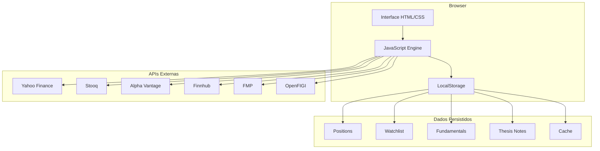
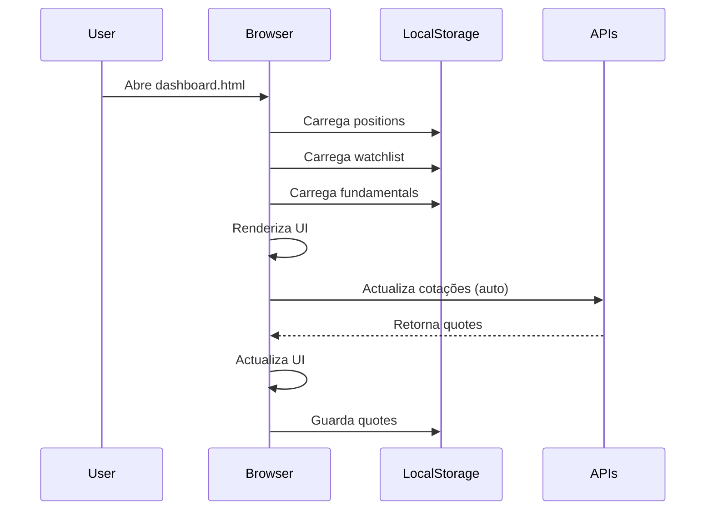
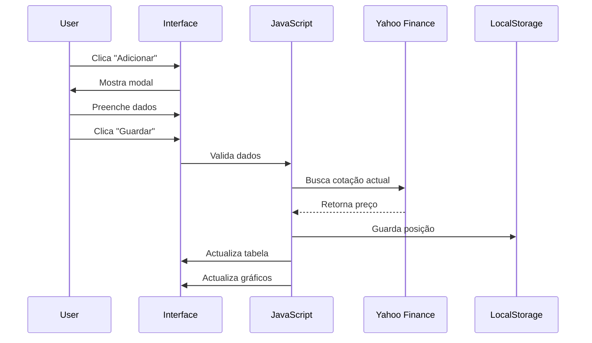
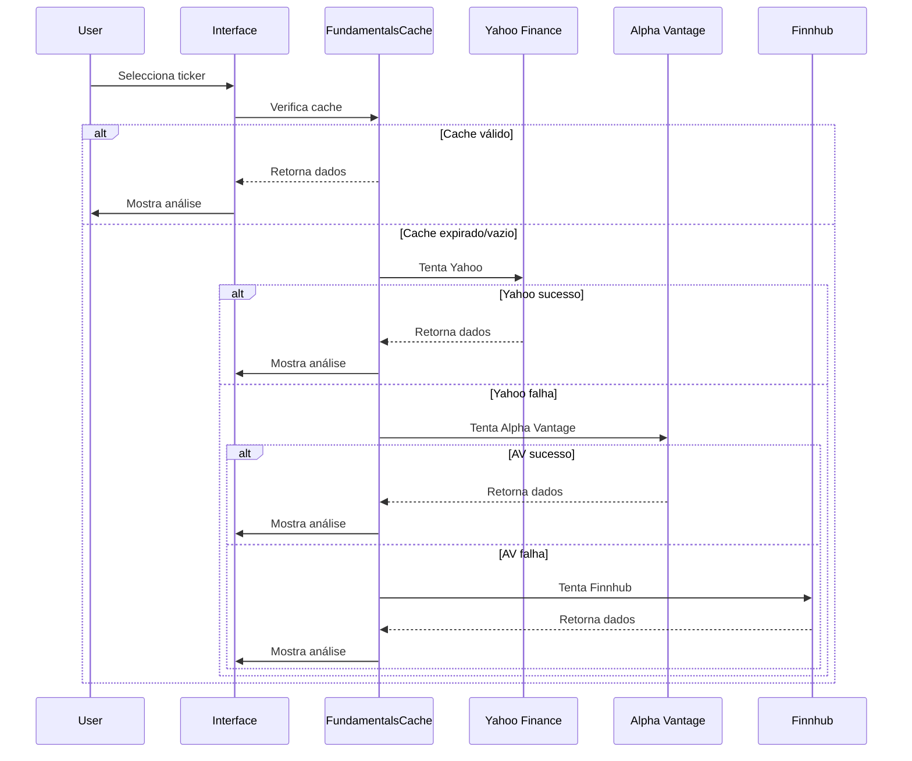
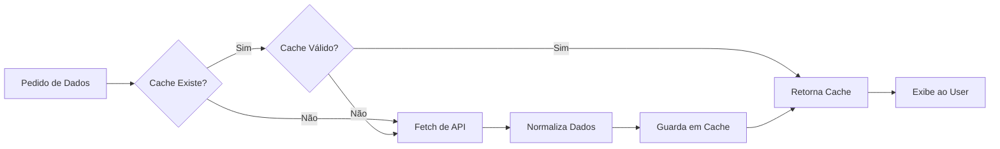

# 🏗️ Arquitetura Técnica - Portfolio Management Dashboard

## 📋 Visão Geral

O Portfolio Management Dashboard é uma aplicação web **single-page** (SPA) construída com tecnologias vanilla (sem frameworks), focada em **simplicidade**, **performance** e **zero dependências de backend**.

### Princípios de Design
- ✅ **Client-side only**: Sem servidor, sem backend
- ✅ **Zero build step**: Funciona direto no browser
- ✅ **Progressive Enhancement**: Funciona offline após primeiro carregamento
- ✅ **Privacy-first**: Dados armazenados localmente no browser
- ✅ **Mobile-friendly**: Responsivo e touch-optimized

---

## 🎨 Stack Tecnológico

### Frontend
```
HTML5
├── Semantic markup
├── Accessibility (ARIA labels)
└── Meta tags para SEO/PWA

CSS3
├── CSS Variables (theming)
├── Flexbox + Grid Layout
├── Media Queries (responsive)
├── Animations (CSS only)
└── Custom properties para cores

JavaScript (ES6+)
├── Vanilla JS (sem frameworks)
├── Async/Await para APIs
├── LocalStorage API
├── Fetch API
├── AbortController (timeouts)
└── Chart.js (única dependência externa)
```

### Bibliotecas Externas
```javascript
// Chart.js - Gráficos interactivos
<script src="https://cdn.jsdelivr.net/npm/chart.js"></script>
```

### APIs de Dados
```
Cotações:
├── Yahoo Finance (primária)
├── Stooq (backup US)
└── CORS Proxies (fallback)

Fundamentais:
├── Yahoo Finance (primária)
├── Alpha Vantage (secundária)
├── Finnhub (terciária)
└── FMP (backup)

Pesquisa:
├── Yahoo Finance Search
└── OpenFIGI (resolução ISIN)
```

---

## 🗂️ Estrutura de Ficheiros

```
portfolio_management/
│
├── dashboard.html              # Aplicação principal (SPA)
├── index.html                  # Landing page (opcional)
├── README.md                   # Documentação principal
├── LICENSE                     # Licença MIT
│
├── .github/
│   └── workflows/
│       └── deploy.yml          # GitHub Actions (deploy)
│
└── plans/                      # Documentação técnica
    ├── roadmap-2026.md         # Roadmap de features
    ├── arquitetura-tecnica.md  # Este ficheiro
    ├── implementacao-tecnica.md # Guia de implementação
    ├── sprints.md              # Plano de sprints
    └── analise-fundamentalista-fix.md
```

---

## 🧩 Arquitectura de Componentes

### Diagrama de Alto Nível



---

## 📦 Modelo de Dados

### 1. Positions (Portfolio)
```javascript
// localStorage key: 'portfolio_v1'
positions = [
  {
    ticker: 'AAPL',           // string (obrigatório)
    name: 'Apple Inc.',       // string (obrigatório)
    sector: 'Tecnologia',     // string (obrigatório)
    currency: 'USD',          // string: USD, EUR, GBP
    qty: 10,                  // number (obrigatório)
    avgPrice: 145.00,         // number (obrigatório)
    curPrice: 189.50          // number (actualizado via API)
  }
]
```

### 2. Watchlist
```javascript
// localStorage key: 'watchlist_v1'
watchlist = [
  {
    ticker: 'NVDA',           // string (obrigatório)
    name: 'Nvidia Corp.',     // string (opcional)
    alert: 900                // number | null (preço de alerta)
  }
]
```

### 3. Fundamentals (Cache)
```javascript
// localStorage key: 'fundamentals_v1'
fundamentals = {
  'AAPL': {
    pe: 28.5,               // P/E Ratio
    evEbitda: 18.2,         // EV/EBITDA
    roe: 147.5,             // Return on Equity (%)
    divYield: 0.52,         // Dividend Yield (%)
    netMargin: 25.3,        // Net Margin (%)
    debtEbitda: 1.2,        // Debt/EBITDA
    marketCap: 2800000000000, // Market Cap (USD)
    beta: 1.24,             // Beta
    description: '...',     // Company description
    sector: 'Technology',   // Sector
    industry: 'Consumer Electronics', // Industry
    employees: 164000       // Number of employees
  }
}
```

### 4. Fundamentals Cache (Novo Sistema)
```javascript
// localStorage key: 'fund_cache_{TICKER}'
{
  ticker: 'AAPL',
  data: { /* fundamentals object */ },
  metadata: {
    source: 'Yahoo Finance',  // Fonte dos dados
    fetchedAt: 1710950000000, // Timestamp
    expiresAt: 1711036400000, // Timestamp (24h depois)
    version: '2.0'            // Versão do schema
  }
}
```

### 5. Thesis Notes
```javascript
// localStorage key: 'thesis_v1'
thesisNotes = {
  'AAPL': 'Forte posição em AI com Apple Intelligence...',
  'MSFT': 'Liderança em cloud computing...'
}
```

### 6. Live Quotes (Runtime)
```javascript
// Não persistido, apenas em memória
liveQuotes = {
  'AAPL': {
    price: 189.50,
    prev: 187.20,
    change: 2.30,
    changePct: 1.23,
    currency: 'USD',
    source: 'Yahoo'
  }
}
```

### 7. API Configuration
```javascript
// localStorage keys: 'api_alphavantage', 'api_finnhub', 'api_fmp'
API_CONFIG = {
  alphavantage: {
    key: 'DEMO1234...',
    baseUrl: 'https://www.alphavantage.co/query',
    rateLimit: { requests: 5, perMinutes: 1 }
  },
  finnhub: {
    key: 'c123456...',
    baseUrl: 'https://finnhub.io/api/v1',
    rateLimit: { requests: 60, perMinutes: 1 }
  },
  fmp: {
    key: 'abc123...',
    baseUrl: 'https://financialmodeprep.com/api/v3',
    rateLimit: { requests: 250, perDay: 1 }
  }
}
```

---

## 🔄 Fluxo de Dados

### 1. Inicialização da Aplicação



### 2. Adicionar Nova Posição



### 3. Carregar Análise Fundamentalista



### 4. Sistema de Cache



---

## 🎯 Componentes Principais

### 1. Navigation System
```javascript
// Gestão de páginas (SPA)
function showPage(id) {
  // Esconde todas as páginas
  document.querySelectorAll('.page').forEach(p => 
    p.classList.remove('active')
  );
  
  // Mostra página seleccionada
  document.getElementById('page-' + id).classList.add('active');
  
  // Actualiza tabs
  updateActiveTabs(id);
  
  // Carrega dados específicos da página
  if (id === 'mercado') renderQuoteGrid();
  if (id === 'watchlist') renderWatchlist();
  if (id === 'analise') renderAnalysisSelector();
}
```

### 2. Data Persistence Layer
```javascript
// Abstração de localStorage
function save() {
  localStorage.setItem('portfolio_v1', JSON.stringify(positions));
}

function load() {
  const data = localStorage.getItem('portfolio_v1');
  return data ? JSON.parse(data) : [];
}

// Versioning para migrações futuras
function migrateData(oldVersion, newVersion) {
  // Lógica de migração entre versões
}
```

### 3. API Orchestrator
```javascript
// Sistema multi-fonte com fallback
async function fetchQuote(ticker) {
  const sources = [
    () => fetchFromStooq(ticker),
    () => fetchFromYahoo(ticker),
    () => fetchFromYahooProxy(ticker)
  ];
  
  for (const fetchFn of sources) {
    try {
      const result = await fetchFn();
      if (result) return result;
    } catch (e) {
      console.warn('Source failed:', e);
      continue;
    }
  }
  
  return null; // Todas falharam
}
```

### 4. Data Adapters
```javascript
// Normalização de dados de diferentes APIs
const DataAdapters = {
  yahoo(raw) {
    return {
      pe: raw.defaultKeyStatistics?.trailingPE?.raw,
      roe: raw.financialData?.returnOnEquity?.raw * 100,
      // ... normaliza todos os campos
    };
  },
  
  alphavantage(raw) {
    return {
      pe: parseFloat(raw.PERatio),
      roe: parseFloat(raw.ReturnOnEquityTTM),
      // ... normaliza todos os campos
    };
  }
};
```

### 5. Cache System
```javascript
const FundamentalsCache = {
  TTL: 24 * 60 * 60 * 1000, // 24 horas
  
  get(ticker) {
    const cached = localStorage.getItem(`fund_cache_${ticker}`);
    if (!cached) return null;
    
    const data = JSON.parse(cached);
    const age = Date.now() - data.metadata.fetchedAt;
    
    if (age > this.TTL) {
      localStorage.removeItem(`fund_cache_${ticker}`);
      return null;
    }
    
    return data;
  },
  
  set(ticker, data, source) {
    const cacheData = {
      ticker,
      data,
      metadata: {
        source,
        fetchedAt: Date.now(),
        expiresAt: Date.now() + this.TTL,
        version: '2.0'
      }
    };
    
    localStorage.setItem(`fund_cache_${ticker}`, 
      JSON.stringify(cacheData));
  }
};
```

### 6. Smart Search
```javascript
// Pesquisa multi-fonte (ticker, nome, ISIN)
async function searchTickers(query) {
  // Detecta ISIN
  if (isISIN(query)) {
    return await isinToTicker(query);
  }
  
  // Pesquisa normal
  const direct = await yahooSearch(query);
  if (direct.length > 0) return direct;
  
  // Fallback com proxy
  return await yahooSearchProxy(query);
}

function isISIN(q) {
  return /^[A-Z]{2}[A-Z0-9]{10}$/.test(q.trim().toUpperCase());
}
```

### 7. Chart Manager
```javascript
// Gestão de gráficos Chart.js
let allocChart = null;
let priceChart = null;

function renderAllocChart() {
  if (allocChart) allocChart.destroy();
  
  allocChart = new Chart(canvas, {
    type: 'doughnut',
    data: { /* ... */ },
    options: { /* ... */ }
  });
}

function destroyCharts() {
  if (allocChart) allocChart.destroy();
  if (priceChart) priceChart.destroy();
}
```

---

## 🔐 Segurança e Privacidade

### Princípios
1. **Zero Server-Side**: Sem backend = sem risco de breach
2. **Local-First**: Dados nunca saem do browser
3. **API Keys Client-Side**: Utilizador controla suas próprias keys
4. **HTTPS Only**: GitHub Pages força HTTPS
5. **No Tracking**: Sem analytics, sem cookies de terceiros

### Considerações
```javascript
// API keys armazenadas em localStorage
// ⚠️ Visíveis no DevTools, mas aceitável porque:
// 1. São keys gratuitas do próprio utilizador
// 2. Têm rate limits baixos
// 3. Não dão acesso a dados sensíveis
// 4. Alternativa seria backend (mais complexo)

// Dados financeiros
// ✅ Nunca enviados para servidor
// ✅ Apenas armazenados localmente
// ✅ Utilizador pode exportar/apagar a qualquer momento
```

---

## ⚡ Performance

### Optimizações Implementadas

#### 1. Cache Inteligente
```javascript
// Reduz chamadas API em ~80%
// TTL de 24h para dados fundamentais
// Cache de cotações em memória (runtime)
```

#### 2. Lazy Loading
```javascript
// Dados carregados apenas quando necessário
if (id === 'analise') {
  loadAnalysisData(); // Só carrega se página activa
}
```

#### 3. Debouncing
```javascript
// Pesquisa com delay de 400ms
let searchTimer;
function onSearchInput(val) {
  clearTimeout(searchTimer);
  searchTimer = setTimeout(() => {
    performSearch(val);
  }, 400);
}
```

#### 4. Abort Controllers
```javascript
// Timeout de requests
const res = await fetch(url, {
  signal: AbortSignal.timeout(8000)
});
```

#### 5. Batch Updates
```javascript
// Actualiza múltiplas cotações em paralelo
await Promise.all(tickers.map(t => fetchQuote(t)));
```

### Métricas Alvo
- **First Paint**: <1s
- **Time to Interactive**: <2s
- **API Response**: <3s (90th percentile)
- **Cache Hit Rate**: >70%
- **Bundle Size**: ~100KB (HTML+CSS+JS inline)

---

## 🧪 Testing Strategy

### Testes Manuais
```javascript
// Console do browser
console.log('Positions:', positions);
console.log('Cache:', FundamentalsCache.get('AAPL'));
console.log('API Config:', API_CONFIG);

// Testar APIs
await fetchQuote('AAPL');
await fetchFundamentals('MSFT');
```

### Testes de Integração
- [ ] Adicionar posição → Verificar localStorage
- [ ] Actualizar cotações → Verificar UI actualizada
- [ ] Carregar análise → Verificar cache usado
- [ ] Pesquisar ticker → Verificar resultados

### Testes de Compatibilidade
- [ ] Chrome 90+
- [ ] Firefox 88+
- [ ] Safari 14+
- [ ] Edge 90+
- [ ] Mobile browsers

---

## 🚀 Deployment

### GitHub Pages
```yaml
# .github/workflows/deploy.yml
name: Deploy to GitHub Pages

on:
  push:
    branches: [ main ]

jobs:
  deploy:
    runs-on: ubuntu-latest
    steps:
      - uses: actions/checkout@v2
      - name: Deploy
        uses: peaceiris/actions-gh-pages@v3
        with:
          github_token: ${{ secrets.GITHUB_TOKEN }}
          publish_dir: ./
```

### Configuração
1. Settings → Pages
2. Source: `gh-pages` branch
3. URL: `https://username.github.io/portfolio_management/`

---

## 📊 Monitoring

### Client-Side Logging
```javascript
// Console logging estruturado
console.log('✅ Success:', data);
console.warn('⚠️ Warning:', error);
console.error('❌ Error:', error);

// Performance tracking
console.time('fetchFundamentals');
await fetchFundamentals('AAPL');
console.timeEnd('fetchFundamentals');
```

### Error Tracking
```javascript
window.addEventListener('error', (e) => {
  console.error('Global error:', e);
  // Opcional: enviar para serviço de tracking
});

window.addEventListener('unhandledrejection', (e) => {
  console.error('Unhandled promise rejection:', e);
});
```

---

## 🔄 Versionamento

### Schema Versioning
```javascript
// Cada estrutura de dados tem versão
const SCHEMA_VERSION = {
  portfolio: 'v1',
  fundamentals: 'v1',
  cache: 'v2.0'
};

// Migração automática
function migrateIfNeeded() {
  const currentVersion = localStorage.getItem('schema_version');
  if (currentVersion !== SCHEMA_VERSION.portfolio) {
    migratePortfolio(currentVersion, SCHEMA_VERSION.portfolio);
  }
}
```

### Release Process
1. Actualizar versão no README
2. Criar tag Git (`v2.1.0`)
3. Actualizar CHANGELOG
4. Deploy automático via GitHub Actions

---

## 🛠️ Ferramentas de Desenvolvimento

### Recomendadas
- **VS Code** com extensões:
  - Live Server
  - ESLint
  - Prettier
  - GitLens

### DevTools
```javascript
// Helpers para debugging
window.DEBUG = {
  positions: () => console.table(positions),
  cache: () => console.log(FundamentalsCache),
  clearAll: () => localStorage.clear(),
  export: () => exportPortfolio()
};

// Usar no console: DEBUG.positions()
```

---

## 📚 Referências Técnicas

### APIs Documentação
- [Yahoo Finance API](https://query2.finance.yahoo.com/)
- [Alpha Vantage](https://www.alphavantage.co/documentation/)
- [Finnhub](https://finnhub.io/docs/api)
- [FMP](https://site.financialmodeprep.com/developer/docs)
- [OpenFIGI](https://www.openfigi.com/api)

### Bibliotecas
- [Chart.js](https://www.chartjs.org/docs/)
- [MDN Web APIs](https://developer.mozilla.org/en-US/docs/Web/API)

### Padrões
- [LocalStorage Best Practices](https://developer.mozilla.org/en-US/docs/Web/API/Window/localStorage)
- [Fetch API](https://developer.mozilla.org/en-US/docs/Web/API/Fetch_API)
- [Async/Await](https://developer.mozilla.org/en-US/docs/Web/JavaScript/Reference/Statements/async_function)

---

## 🎓 Decisões de Arquitectura

### Por que Vanilla JS?
✅ **Prós**:
- Zero build step
- Sem dependências
- Mais rápido (sem framework overhead)
- Mais fácil de manter
- Funciona em qualquer browser moderno

❌ **Contras**:
- Mais código boilerplate
- Sem reactividade automática
- Gestão manual de estado

### Por que LocalStorage?
✅ **Prós**:
- Simples de usar
- Sem backend necessário
- Funciona offline
- Privacidade total

❌ **Contras**:
- Limite de ~5-10MB
- Sem sync entre dispositivos
- Pode ser limpo pelo browser

### Por que Single HTML File?
✅ **Prós**:
- Deploy trivial
- Funciona offline
- Sem build process
- Fácil de distribuir

❌ **Contras**:
- Ficheiro grande (~2300 linhas)
- Difícil de modularizar
- Sem code splitting

---

## 🔮 Evolução Futura

### Possíveis Melhorias Arquitecturais

#### 1. Modularização
```javascript
// Separar em módulos ES6
import { Portfolio } from './modules/portfolio.js';
import { API } from './modules/api.js';
import { Cache } from './modules/cache.js';
```

#### 2. State Management
```javascript
// Implementar padrão Observer
class Store {
  constructor() {
    this.state = {};
    this.listeners = [];
  }
  
  setState(newState) {
    this.state = { ...this.state, ...newState };
    this.notify();
  }
  
  subscribe(listener) {
    this.listeners.push(listener);
  }
  
  notify() {
    this.listeners.forEach(l => l(this.state));
  }
}
```

#### 3. Service Workers
```javascript
// PWA com offline support
if ('serviceWorker' in navigator) {
  navigator.serviceWorker.register('/sw.js');
}
```

#### 4. IndexedDB
```javascript
// Para portfolios grandes (>100 posições)
const db = await openDB('portfolio', 1, {
  upgrade(db) {
    db.createObjectStore('positions');
  }
});
```

---

**Última Actualização**: 20 Março 2026  
**Versão**: 2.0  
**Autor**: Portfolio Management Team
