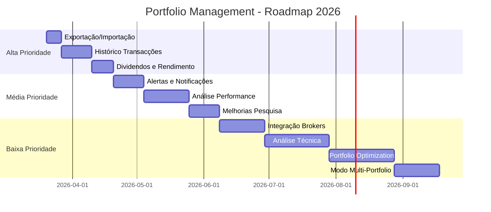

# 🚀 Roadmap de Desenvolvimento - Portfolio Management 2026

## 📊 Estado Atual do Projeto

### ✅ Funcionalidades Implementadas (v2.0)

#### 📈 Core Features
- **Gestão de Portfolio**
  - Adicionar/editar/remover posições
  - Cálculo automático de P&L (lucro/prejuízo)
  - Visualização por sector e activo
  - Gráficos interactivos (Chart.js)
  - Suporte para múltiplas moedas (USD, EUR, GBP)

- **Cotações em Tempo Real**
  - Sistema multi-fonte (Yahoo Finance, Stooq)
  - Fallback automático entre APIs
  - Actualização manual e automática
  - Suporte para mercados globais (US, PT, EU, UK)

- **Análise de Mercado**
  - Gráficos históricos de preços (1M, 3M, 6M, 1A, 5A)
  - Pesquisa inteligente de tickers (ISIN, nome, símbolo)
  - Mini cotações do portfolio

- **Watchlist**
  - Acompanhamento de tickers favoritos
  - Alertas de preço configuráveis
  - Cotações actualizadas automaticamente

- **Análise Fundamentalista** ⭐
  - Sistema multi-API com fallback (Yahoo, Alpha Vantage, Finnhub, FMP)
  - Cache inteligente de 24h
  - Métricas: P/E, ROE, EV/EBITDA, Dividend Yield, etc.
  - Score de atractividade automático (0-100)
  - Tese de investimento personalizável
  - Comparação entre empresas
  - Configuração de API keys

#### 🛠️ Infraestrutura
- Persistência local (localStorage)
- Sistema de cache inteligente
- Adaptadores de dados normalizados
- Error handling robusto
- UI responsiva (mobile-friendly)

---

## 🎯 Próximas Melhorias Prioritárias

### 🔴 Alta Prioridade (Próximas 2-4 semanas)

#### 1. **Exportação e Importação de Dados**
**Problema**: Dados apenas em localStorage, sem backup
**Solução**:
- Exportar portfolio para JSON/CSV
- Importar dados de ficheiros
- Backup automático para download

**Impacto**: 🔥🔥🔥 Crítico para não perder dados

**Implementação**:
```javascript
// Exportar
function exportPortfolio() {
  const data = {
    positions: positions,
    watchlist: watchlist,
    fundamentals: fundamentals,
    thesis: thesisNotes,
    exportDate: new Date().toISOString()
  };
  
  const blob = new Blob([JSON.stringify(data, null, 2)], 
    { type: 'application/json' });
  const url = URL.createObjectURL(blob);
  const a = document.createElement('a');
  a.href = url;
  a.download = `portfolio-backup-${Date.now()}.json`;
  a.click();
}

// Importar
function importPortfolio(file) {
  const reader = new FileReader();
  reader.onload = (e) => {
    const data = JSON.parse(e.target.result);
    positions = data.positions || [];
    watchlist = data.watchlist || [];
    fundamentals = data.fundamentals || {};
    thesisNotes = data.thesis || {};
    save(); saveWL(); saveFundamentals(); saveThesisNotes();
    render();
    toast('Portfolio importado com sucesso ✓', 'ok');
  };
  reader.readAsText(file);
}
```

---

#### 2. **Histórico de Transacções**
**Problema**: Não há registo de compras/vendas ao longo do tempo
**Solução**:
- Adicionar página "📜 Histórico"
- Registar todas as transacções (compra, venda, dividendos)
- Calcular P&L realizado vs latente
- Gráfico de evolução do portfolio

**Impacto**: 🔥🔥 Muito útil para análise de performance

**Estrutura de Dados**:
```javascript
const transactions = [
  {
    id: 'tx_001',
    type: 'BUY',  // BUY, SELL, DIVIDEND
    ticker: 'AAPL',
    date: '2024-01-15',
    qty: 10,
    price: 145.00,
    fees: 5.00,
    total: 1455.00,
    currency: 'USD',
    notes: 'Compra inicial'
  }
];
```

---

#### 3. **Dividendos e Rendimento**
**Problema**: Não há tracking de dividendos recebidos
**Solução**:
- Adicionar campo de dividendos por posição
- Calcular yield on cost
- Histórico de dividendos recebidos
- Projecção de rendimento anual

**Impacto**: 🔥🔥 Importante para investidores de dividendos

**UI Proposta**:
```html
<div class="card">
  <div class="section-title">💰 Rendimento de Dividendos</div>
  <div class="grid-3">
    <div class="metric">
      <label>Dividendos Anuais</label>
      <value>€1,234.56</value>
    </div>
    <div class="metric">
      <label>Yield on Cost</label>
      <value>4.2%</value>
    </div>
    <div class="metric">
      <label>Próximo Pagamento</label>
      <value>15 Abr 2026</value>
    </div>
  </div>
</div>
```

---

### 🟡 Média Prioridade (1-2 meses)

#### 4. **Alertas e Notificações**
**Funcionalidades**:
- Alertas de preço (já existe na watchlist, expandir)
- Alertas de P/E ratio
- Alertas de notícias importantes
- Notificações browser (opcional)

**Implementação**:
```javascript
const alerts = [
  {
    ticker: 'AAPL',
    type: 'PRICE_BELOW',
    value: 150,
    active: true,
    triggered: false
  },
  {
    ticker: 'MSFT',
    type: 'PE_BELOW',
    value: 25,
    active: true,
    triggered: false
  }
];

function checkAlerts() {
  alerts.forEach(alert => {
    if (!alert.active || alert.triggered) return;
    
    const quote = liveQuotes[alert.ticker];
    if (!quote) return;
    
    if (alert.type === 'PRICE_BELOW' && quote.price <= alert.value) {
      triggerAlert(alert);
    }
  });
}
```

---

#### 5. **Análise de Performance**
**Funcionalidades**:
- Gráfico de evolução do portfolio ao longo do tempo
- Comparação com benchmarks (S&P 500, PSI-20)
- Métricas de risco (Sharpe ratio, volatilidade)
- Análise de correlação entre activos

**Visualizações**:
- Linha temporal do valor total
- Heatmap de correlação
- Distribuição de retornos

---

#### 6. **Melhorias na Pesquisa**
**Funcionalidades**:
- Filtros avançados (sector, P/E, dividend yield)
- Screener de acções
- Comparação lado-a-lado de múltiplos tickers
- Sugestões baseadas no portfolio actual

---

### 🟢 Baixa Prioridade (3+ meses)

#### 7. **Integração com Brokers**
**Funcionalidades**:
- Importar transacções de CSV (Degiro, Interactive Brokers)
- Sincronização automática (se possível)
- Reconciliação de dados

---

#### 8. **Análise Técnica**
**Funcionalidades**:
- Indicadores técnicos (RSI, MACD, Bollinger Bands)
- Padrões de candlestick
- Suporte/resistência automático

---

#### 9. **Portfolio Optimization**
**Funcionalidades**:
- Sugestões de rebalanceamento
- Análise de diversificação
- Simulador de cenários
- Calculadora de alocação óptima

---

#### 10. **Modo Multi-Portfolio**
**Funcionalidades**:
- Criar múltiplos portfolios (ex: "Longo Prazo", "Trading")
- Comparar performance entre portfolios
- Consolidação de todos os portfolios

---

## 📋 Roadmap Visual



---

## 🏗️ Arquitectura Técnica Actual

### Stack Tecnológico
```
Frontend:
├── HTML5 + CSS3 (Vanilla)
├── JavaScript (ES6+)
├── Chart.js (gráficos)
└── LocalStorage (persistência)

APIs:
├── Yahoo Finance (cotações + fundamentais)
├── Stooq (cotações backup)
├── Alpha Vantage (fundamentais)
├── Finnhub (fundamentais)
├── FMP (fundamentais backup)
└── OpenFIGI (resolução ISIN)

Deployment:
└── GitHub Pages (estático)
```

### Estrutura de Dados
```javascript
// Portfolio
positions = [
  {
    ticker: 'AAPL',
    name: 'Apple Inc.',
    sector: 'Tecnologia',
    currency: 'USD',
    qty: 10,
    avgPrice: 145.00,
    curPrice: 189.50
  }
];

// Watchlist
watchlist = [
  {
    ticker: 'NVDA',
    name: 'Nvidia',
    alert: 900
  }
];

// Fundamentals (cached)
fundamentals = {
  'AAPL': {
    pe: 28.5,
    roe: 147.5,
    // ... outras métricas
  }
};

// Thesis Notes
thesisNotes = {
  'AAPL': 'Forte posição em AI...'
};
```

---

## 🧪 Plano de Testes

### Testes Funcionais
- [ ] Adicionar/editar/remover posições
- [ ] Actualizar cotações (todas as fontes)
- [ ] Carregar análise fundamentalista (todas as APIs)
- [ ] Exportar/importar dados
- [ ] Pesquisa de tickers (ISIN, nome, símbolo)
- [ ] Gráficos históricos (todos os períodos)
- [ ] Watchlist e alertas
- [ ] Cache de dados

### Testes de Compatibilidade
- [ ] Chrome/Edge (desktop)
- [ ] Firefox (desktop)
- [ ] Safari (desktop + mobile)
- [ ] Chrome Mobile (Android)

### Testes de Performance
- [ ] Carregar 50+ posições
- [ ] Actualizar 50+ cotações
- [ ] Cache hit rate >70%
- [ ] Tempo de resposta <3s

### Testes de Mercados
- [ ] Tickers US (AAPL, MSFT, GOOGL)
- [ ] Tickers PT (EDP.LS, GALP.LS)
- [ ] Tickers EU (SAP.DE, AIR.PA)
- [ ] Tickers UK (VOD.L, BP.L)
- [ ] ETFs (SPY, QQQ, IWDA.AS)

---

## 📚 Documentação Necessária

### Para Utilizadores
- [ ] Guia de início rápido
- [ ] Como obter API keys
- [ ] FAQ de troubleshooting
- [ ] Vídeo tutorial (opcional)

### Para Developers
- [ ] Arquitectura do sistema
- [ ] Guia de contribuição
- [ ] Documentação de APIs
- [ ] Changelog detalhado

---

## 🎯 Métricas de Sucesso

### Funcionalidade
- ✅ Taxa de sucesso de cotações: >95%
- ✅ Taxa de sucesso de fundamentais: >90%
- ✅ Cache hit rate: >70%
- ⏳ Tempo médio de resposta: <3s
- ⏳ Uptime: >99%

### Usabilidade
- ⏳ Tempo para adicionar posição: <30s
- ⏳ Tempo para ver análise: <5s
- ⏳ Mobile-friendly: Sim
- ⏳ Acessibilidade: WCAG 2.1 AA

### Qualidade
- ⏳ Zero bugs críticos
- ⏳ Cobertura de testes: >80%
- ⏳ Documentação completa
- ⏳ Código bem comentado

---

## 🚀 Próximos Passos Imediatos

### Esta Semana (20-27 Mar 2026)
1. **Implementar Exportação/Importação**
   - Botão "💾 Exportar Portfolio"
   - Botão "📂 Importar Portfolio"
   - Validação de dados importados
   - Testes com dados reais

2. **Melhorar Documentação**
   - Actualizar README.md
   - Criar guia de utilizador
   - Documentar APIs usadas

3. **Testes de Validação**
   - Testar com 20+ tickers diferentes
   - Validar todas as fontes de dados
   - Verificar performance

### Próximo Mês (Abr 2026)
1. **Histórico de Transacções**
   - Nova página "📜 Histórico"
   - Formulário de adicionar transacção
   - Cálculo de P&L realizado
   - Gráfico de evolução

2. **Dividendos**
   - Campo de dividendos por posição
   - Cálculo de yield on cost
   - Calendário de pagamentos

---

## 💡 Ideias Futuras (Backlog)

### Features Avançadas
- 🔮 Previsões com ML (opcional)
- 🌍 Suporte para criptomoedas
- 📊 Dashboard executivo (resumo)
- 🔔 Integração com Telegram/Discord
- 📱 Progressive Web App (PWA)
- 🌙 Modo escuro/claro toggle
- 🌐 Multi-idioma (EN, PT, ES)
- 📈 Backtesting de estratégias
- 🤖 Recomendações automáticas
- 📊 Relatórios PDF exportáveis

### Integrações
- 📧 Email de relatórios semanais
- 📱 App mobile nativa (React Native)
- 🔗 API pública para outros apps
- 💾 Sync com Google Drive/Dropbox
- 🔐 Autenticação (Firebase/Supabase)

---

## 🤝 Como Contribuir

### Para este Projeto
1. Fork o repositório
2. Cria um branch para a feature (`git checkout -b feature/nova-funcionalidade`)
3. Commit as mudanças (`git commit -m 'Adiciona nova funcionalidade'`)
4. Push para o branch (`git push origin feature/nova-funcionalidade`)
5. Abre um Pull Request

### Áreas que Precisam de Ajuda
- 🎨 Design/UI improvements
- 🧪 Testes automatizados
- 📚 Documentação
- 🌐 Traduções
- 🐛 Bug fixes

---

## 📞 Contacto e Suporte

- **Issues**: [GitHub Issues](https://github.com/seu-usuario/portfolio_management/issues)
- **Discussões**: [GitHub Discussions](https://github.com/seu-usuario/portfolio_management/discussions)
- **Email**: (adicionar se aplicável)

---

## 📄 Licença

MIT License - Vê [LICENSE](../LICENSE) para detalhes

---

**Última Actualização**: 20 Março 2026
**Versão Actual**: 2.0
**Próxima Release**: 2.1 (Exportação/Importação)
